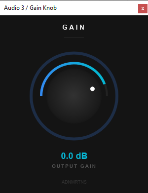

# gain-knob

An example VST3/CLAP plugin demonstrating how to use [nice-plug-slint](https://github.com/aidan729/nice-plug-slint) to build a native Slint GUI for a [nice-plug](https://codeberg.org/RustAudio/nice-plug) audio plugin.



## What it does

A single-knob gain plugin (-60 dB to +6 dB) with a clean, GPU-accelerated UI built entirely in Slint.

## Building

```sh
cargo build --release
cargo xtask bundle gain_knob --release
```

The bundled VST3/CLAP will be placed in `target/bundled/`.

## Project structure

```
gain-knob/
├── src/
│   ├── lib.rs          # Plugin + DSP logic
│   └── gui/
│       ├── mod.rs      # Slint module include
│       ├── ui.slint    # Main window layout
│       └── DSL/
│           └── knob.slint  # Reusable knob component
├── build.rs            # Compiles Slint UI
└── xtask/              # nice-plug bundler
```

## Using nice-plug-slint

See [nice-plug-slint](https://github.com/aidan729/nice-plug-slint) for the full API reference and documentation.
